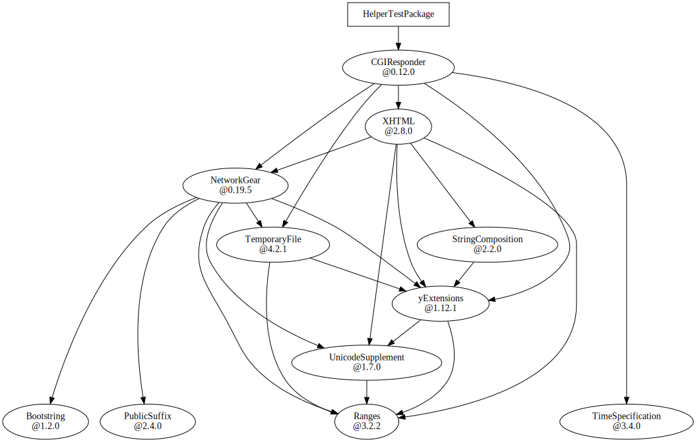
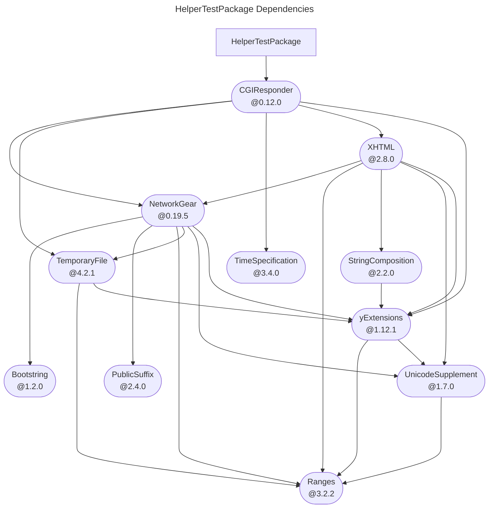

#  What is this repository?

This repository contains some niche tools for Swift packages.

## How to install?

1. Clone this repository: `git clone https://github.com/YOCKOW/SwiftPackageHelperTools.git`
2. Add `/path/to/repository/SwiftPackageHelperTools/bin` to `PATH` environment variable.

### Alternative

- Copy `./bin/spm-helper` into one of your `PATH` directories.


## Tools

You can invoke subcommands through `spm-helper`:

```console
spm-helper <subcommand> [options]
```

### `dep-json`

This subcommand prints the resolved dependency graph with JSON format.  
This is equivalent to `swift package show-dependencies --format json`.


### `dep-pretty-dot`

This subcommand prints the resolved dependency graph with DOT format.  
The generated DOT outputs are prettier than `swift package show-dependencies --format dot`.

#### Samples:

- Raw: [sample.dot](./sample.dot)
- SVG: [sample.dot.svg](./sample.dot.svg) 


### `dep-mermaid`

This subcommand prints the resolved dependency graph with Mermaid format.  

#### Samples

- Raw: [sample.mmd](./sample.mmd)

<!-- SWIFT PACKAGE DEPENDENCIES MERMAID START -->

<!-- SWIFT PACKAGE DEPENDENCIES MERMAID END -->


- SVG: [sample.mmd.svg](./sample.mmd.svg) 

# License

MIT License.  
See "LICENSE.txt" for more information.
